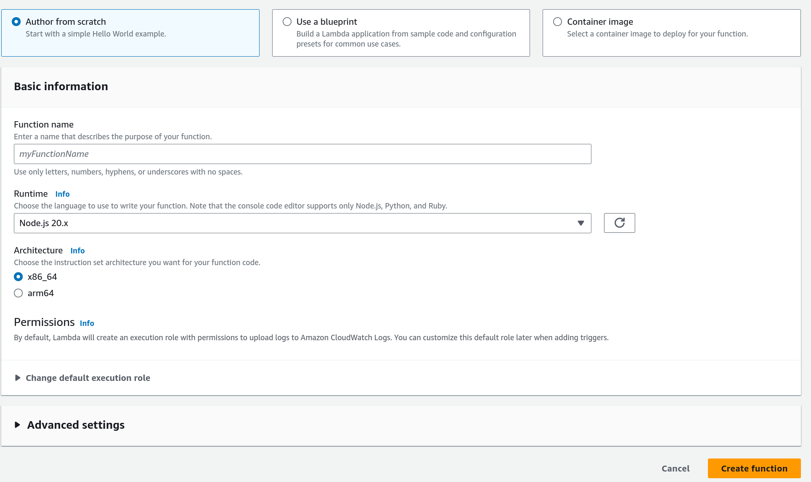
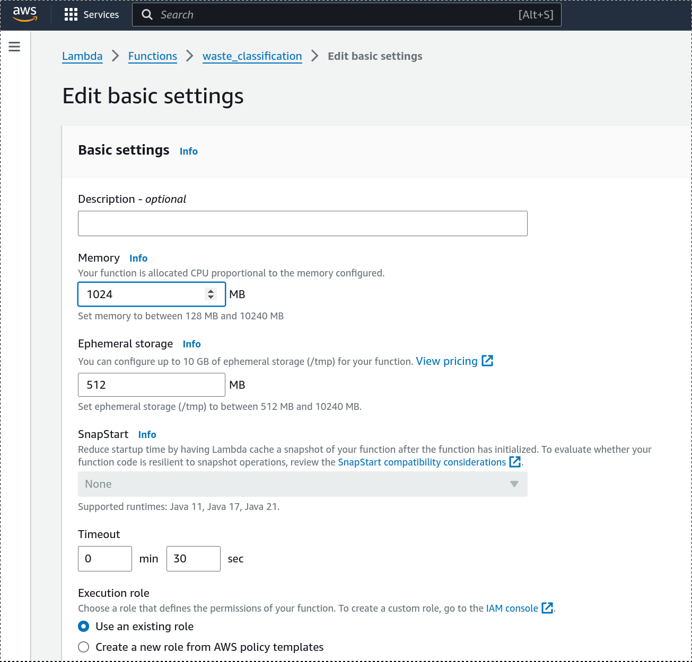
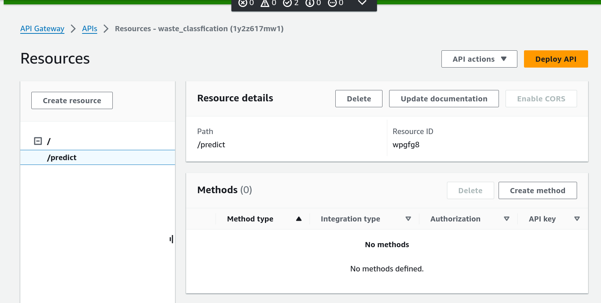
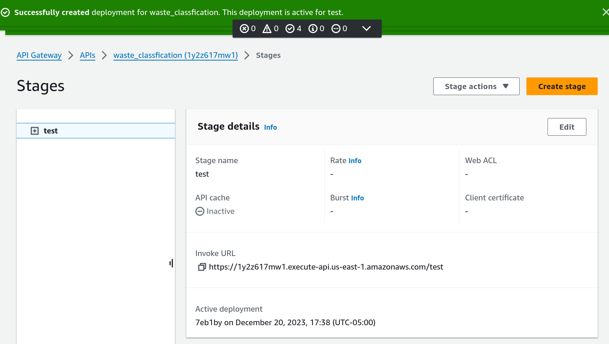

# Problem Description

Two billion tons of waste are dumped on the planet every year and has negative consequences such as pollution of soil, oceans, groundwater and air, harming habitats and negatively impacting wildlife and the quality of the food chain that ultimately has effects on humans. This effects are clearly illustrated by a recent study that showed that microplastics were found in the bloodstream of 77% of tested subjects. \
One solution to this problem are robots that are able to sort waste by material automatically, they solve the problem of small percentage of waste being recycled, the cost of sorting the waste is way higher than that of just putting the waste into a landfill. \
These robots may use deep learning techniques to detect the material of the waste, this is the subject of this project. We train a neural network for this purpose and achieve a high accuracy that makes it valuable for being employed on field. \
We use the RealWaste dataset, which is an image dataset assembled from waste material received at the Whyte's Gully Waste and Resource Recovery facility in Wollongong NSW Australia. The dataset is composed of the following labels and image counts:
  - Cardboard: 461
  - Food Organics: 411
  - Glass: 420
  - Metal: 790
  - Miscellaneous Trash: 495
  - Paper: 500
  - Plastic: 921
  - Textile Trash: 318
  - Vegetation: 436
  
Original work: [RealWaste: A Novel Real-Life Data Set for Landfill Waste Classification Using Deep Learning](https://www.mdpi.com/2078-2489/14/12/633).

# Model description

The xception model provided in the tensorflow library has been used along transfer learning techniques to fine tune it for the purposes of garbage classification with the dataset RealWaste. The notebooks have been used in the following order:

1. get-dataset.ipynb: Download dataset and organize the files and folders.
2. split-data.ipynb: Split dataset into train, validation, test data sets in different folders.
3. project.ipynb: Using the split dataset train the xception model and tune it chaning the learning rate, size of inner layers, dropout rate and augmentations.

# Executing the training and local deployment
## Dependencies

A Pipfile is provided with the necessary dependencies the scripts were verified to work with. To install them use the following commands. If you have pipenv already installed in your computer you can skip the first command.

```
pip install --user pipenv
pipenv install 
```

## Training

Execute the project.py script and wait until download, split and training is done. 

```
python3 project.py
```

Then copy the best accuracy model into the folder serverless and change its name to 'waste_classification_model.h5', execute serverless/convert-model.py and a tensorflow lite file version of the model will show serverless/waste_classification_model.tflite. This is the model that will be used with APIs.
```
cp <best model.h5> serverless/waste_classification_model.h5
python3 serverless/convert-model.py
```

## Containerization and local deployment

A docker image has been provided in the folder 'serverless' that uses an amazon lambda container for later deployment in this platform, it can also be deployed locally by executing:
```
cd serverless
docker build -t waste_classification .
docker run -it --rm -p 8080:8080 waste_classification:latest
```

To test the service execute the file test.py in another terminal with the same working directory

```
python3 test.py
```
## Deployment on AWS Lambda 

### Creating access key and configuring client

To use our image in AWS we need to store it in the AWS ECR and for that we need to configure our client, if we don't have it installed on our machines we can execute:

```
pip install awscli
```

Then to configure the client we need to create an access key in AWS console and save the id and password:

```
AWS Console -> Account -> Security Credentials -> Create access key
```

Then we have to login to our account using the following command and copying the access keys we just created:
```
aws configure
```
### Creating repository for images

We go to the AWS console, search for Amazon Elastic Container Registry and create a repository, we give it a name and leave all the other settings by default. 


Then we select the our repository and click view push commands, we have to open the terminal and have as working directory the folder 'serverless' which contains the Dockerfile and execute each command in order.


### Creating the lambda function

We go to the AWS console, search for Lambda and click on create function


Select the container image we uploaded recently to ECR, put a name for the function and leave the other settings by default, then we click on create function



We have to change some configuration regarding memory size and timeout for that we go to the configuration tab and change memory to 1024 and timeout to a minimum of 30 seconds



### Exposing the API

We go to the AWS console, search for API Gateway and click on Create API, select REST API (not private) give it a suitable name and finally click on create.


We click on create resource and type in 'predict' for our Resource name and click on create



We click then on create method and select meethod type POST, integration type Lambda, select the region and the lambda function we just created, then click on create.

Finally, we click on Deploy API, Stage \*New Stage\* give it a stage name and click on deploy, we finally get an Invoke URL that we can use with our test.py file, we have to add /predict.



### Testing the API

To test the service execute the test_lambda.py file

```
python3 test-lambda.py
```


# References 
https://www.theworldcounts.com/challenges/planet-earth/waste/global-waste-problem \
https://19january2021snapshot.epa.gov/trash-free-waters/impacts-mismanaged-trash_.html#:~:text=Trash%20can%20travel%20throughout%20the,river%2C%20marine%20and%20coastal%20environments. \
https://www.henryford.com/blog/2022/04/microplastics-in-human-bloodstream#:~:text=Recently%2C%20scientists%20discovered%20microplastics%20in,the%20Henry%20Ford%20Cancer%20Institute. \
https://howtorobot.com/expert-insight/recycling-robots#:~:text=Waste%20Sorting%20Robot%20Solutions&text=The%20AI%2Dvision%20system%20detects,on%20the%20kind%20of%20material.